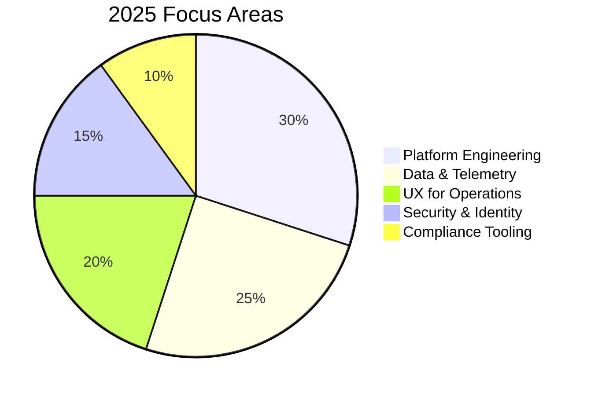
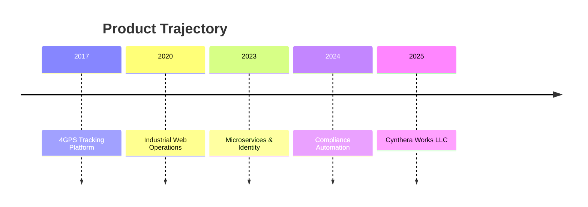

<!--
Profile README for stefan2420
--> 

  

  
  
  

<h2 align="center">Building clear, reliable systems for real-world operations</h2>

I design and ship full-stack platforms with strong data foundations, elegant UI, and production-grade infrastructure. I lead Cynthera Works LLC, delivering software for regulated industries, logistics, and energy systems.

---

### Now
- Shipping modern, secure platforms with microservices and event-driven data flows
- Building operational tools for monitoring, reporting, and compliance
- Scaling UX for complex workflows without sacrificing clarity

---

### Featured Projects

**PV Monitoring Platform** (Microservices, Keycloak, PostgreSQL)
- Remote monitoring and SIM reset management for photovoltaic systems
- API gateway + service discovery + dedicated databases per service

**4GPS Tracking & Reporting** (PHP, Slim, Twig)
- GPS tracking, reporting, and web UI with a fast operational footprint

**QCA Incident Notification Tool** (Spring Boot, DORA compliance)
- Enterprise incident management with audited workflows and reporting

**Hydrotech Pivot Visualization** (Flutter)
- Performance-optimized visualization of large fleet maps and animations

---

### Focus Map

---

### Stack Snapshot

  
  
  
  
  
  
  
  

---

### Cynthera Works LLC

- Modern platforms for operational visibility, compliance, and performance
- Focused on crisp UX, reliable pipelines, and deployable results
- Building long-term systems, not short-term demos

---

### Live Metrics

  
  

  

---

### Let's Build

If you're looking for production-grade systems with clear UX and durable architecture, let's connect.

  

